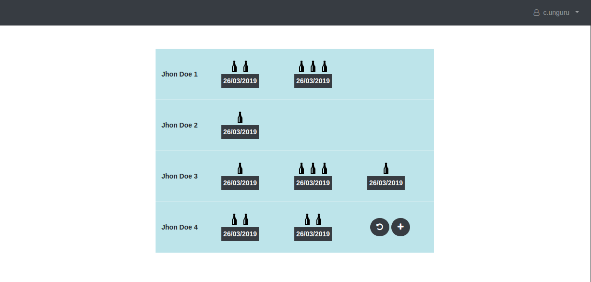

# Team apps milk frontend

## Team apps

Team apps category is a set of applications that all share the same authentication server.
The applications in the team apps category are simple applications that are to be used by a team in their office.
The applications can be various and are solely developed for fun amongst the team.

This is the first app I've developed for the teamapps category; it's a simple milk management frontend that manages who buys milk for coffe in the office :);

- Milk app service: https://github.com/Slidem/team-apps-milk-service
- Authentication server (backend): https://github.com/Slidem/team-apps-oauth2-server
- Authentication server (frontend): https://github.com/Slidem/team-apps-login

## The project

Simple front-end app developed with react, using milk-service for the backend and the team apps authentication server for authentication.

## Goal

The goal of the application was not only to develop something fun (and usefull) to be used in the office,
but also to play around with **React** and learn developing **react components**, understanding the **react state**,
playing around with **javascript es6** and also with **boostrap 4**.

## Tehnologies used:

- React JS
- Bootstrap 4
- Axios library (For AJAX calls to the milk-service)
